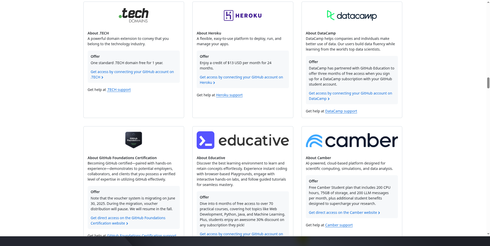
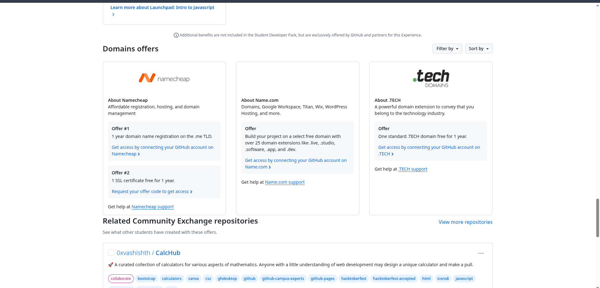
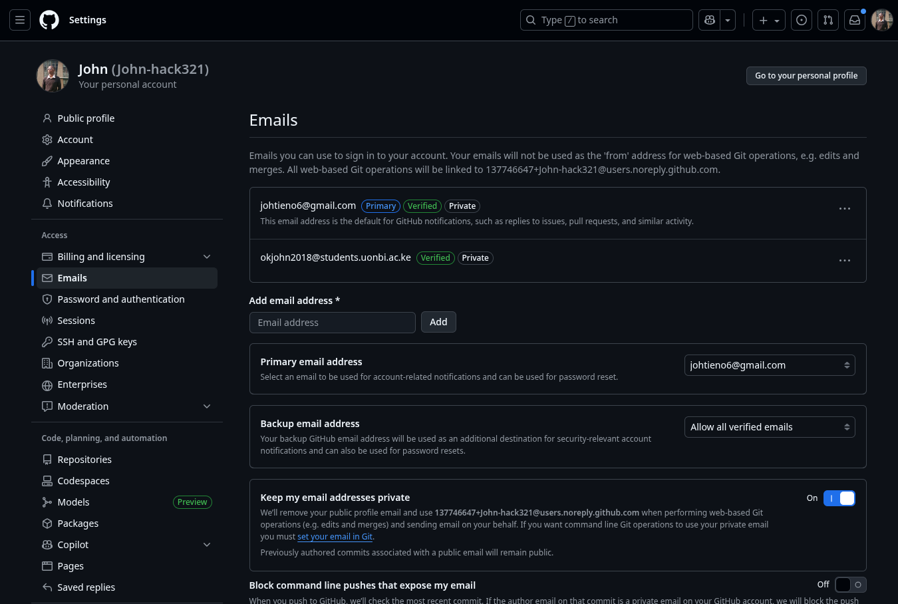

Let me paint you a familiar picture: You've just spent the entire weekend coding up what might be your best project yet. The logic flows beautifully, the UI doesn't make your eyes bleed, and you're genuinely proud of what you've built. There's just one tiny problem—it's sitting on localhost:3000, invisible to the world except for that one time you awkwardly screen-shared during a virtual meetup.

Sound familiar? Yeah, I've been there too. For months, my projects lived in the shadows of GitHub repos, condemned to README screenshots that never quite captured the magic of a live, interactive application. That all changed when I stumbled upon what might be the best-kept secret in the student developer community: multiple free domains hiding in plain sight within the GitHub Student Developer Pack.

And before you ask—no, this isn't one of those "free" deals where you need to enter your credit card details and remember to cancel before the trial ends. This is legitimately, actually, genuinely free. Let me show you exactly how to claim not one, not two, but potentially three different domains for your projects.

## Why Your Projects Deserve Better Than a GitHub Link

Here's the thing about domains that nobody really talks about: they're not just URLs. They're credibility builders. When you're applying for internships, freelance gigs, or trying to impress that startup founder you met at a hackathon, there's a world of difference between saying "check out my project at github.com/username/random-repo-name" versus "visit my app at yourname.dev."

I learned this the hard way during my sophomore year. I'd built this elaborate task management app with real-time collaboration features, user authentication, the works. But when I shared it with potential employers, all they saw was a wall of code on GitHub. The few who actually cloned and ran it locally? Yeah, that number was approximately zero.

The moment I deployed that same project to a custom domain, everything changed. Suddenly, people were actually using it, sharing it, and—most importantly—remembering it. That's when I realized: **visibility isn't just about building great things; it's about making those things accessible to the people who matter.**

*The GitHub Student Developer Pack dashboard showing available offers*

## The GitHub Student Developer Pack: More Than Just Free Stuff

Before we dive into the domain specifics, let's talk about what the GitHub Student Developer Pack actually is. Think of it as the ultimate care package for student developers—except instead of ramen and energy drinks, you get enterprise-level tools that would normally cost hundreds or thousands of dollars per year.

We're talking about:

- **Cloud computing credits** worth thousands of dollars from AWS, Azure, and DigitalOcean
- **Premium IDE licenses** for tools like JetBrains and GitKraken
- **Learning resources** from platforms like Educative and DataCamp
- **Design tools** including Canva Pro and Bootstrap Studio
- And yes, those **sweet, sweet free domains** we're about to explore

The pack gets updated regularly too. Just last semester, they added new partners and increased the benefits for existing ones. It's honestly ridiculous how much value they're giving away—but hey, I'm not complaining.

## The Domain Trifecta: What You're Actually Getting

Alright, let's get to the good stuff. Once you're approved for the Student Developer Pack, you unlock access to three different domain providers, each offering something unique:

### 1. Namecheap: The `.me` Domain

Namecheap throws in a free `.me` domain for one year, plus free SSL certificates. The `.me` extension is perfect for personal branding—think `firstname.me` or `lastnamedev.me`. It's short, memorable, and has that personal touch that makes it ideal for portfolios and resume sites.

What I love about Namecheap is their user interface. Even if you've never configured DNS records before (and let's be honest, who has?), their dashboard walks you through everything step-by-step. They also throw in WhoisGuard protection for free, which keeps your personal information private in domain registrations.

### 2. DotTech Domains: The `.tech` Domain

This one's my personal favorite for project showcases. The `.tech` domain screams innovation and immediately tells visitors what they're in for. I've seen students use these for:

- Hackathon projects (`hackathonname.tech`)
- Technical blogs (`yournametalks.tech`)
- Startup MVPs (`coolstartupidea.tech`)

DotTech also includes email forwarding, so you can have professional email addresses like `hello@yourproject.tech` forwarding to your regular Gmail. It's a small touch that adds massive credibility when you're reaching out to potential collaborators or investors.

### 3. Name.com: The Developer's Choice

Name.com is where things get interesting. They don't just offer one extension—you get to choose from several developer-friendly options:

- `.dev` - The gold standard for developer portfolios
- `.app` - Perfect for web applications and mobile app landing pages
- `.live` - Great for streaming projects or real-time applications
- `.games` - Ideal if you're into game development

Each of these extensions comes with built-in security features. For instance, `.dev` domains require HTTPS by default, which means your site will always be secure without any extra configuration.

*Viewing available domain offers in the GitHub Student Developer Pack*

## The Step-by-Step Playbook: From Zero to Three Domains

Let me walk you through exactly how I claimed all three domains, including the gotchas nobody warns you about.

### Step 1: Preparing Your GitHub Account

Before you even think about applying, you need to get your GitHub house in order. This means:

1. **Adding and verifying your school email address**
   - Navigate to Settings → Emails in your GitHub account
   - Click "Add email address" and enter your .edu email
   - Check your inbox for the verification link (pro tip: check spam if it doesn't show up)
   - Set it as your primary email if you want, but it's not required

*Verifying your student email in GitHub*

2. **Making your profile look legitimate**
   - Add a profile picture (yes, it matters)
   - Fill out your bio with your school name and graduation year
   - Pin a couple of your best repositories
   - The verification team actually looks at these things

### Step 2: The Application Process

Head over to [education.github.com/pack](https://education.github.com/pack) and click that beautiful "Get Student Benefits" button. Here's where it gets interesting—you have multiple verification options:

**Option A: School ID Upload**
The classic route. Take a clear photo of your student ID showing:

- Your name (matching your GitHub account)
- Your school's name
- Current enrollment status or expiration date

**Option B: Admission Letter**
This is what I used, and it was surprisingly smooth. Your admission letter needs to show:

- Your full name
- School name and logo
- Admission date or semester
- Some form of official signature or seal

**Option C: School Email Verification**
Some schools have partnerships with GitHub that allow instant verification through your .edu email. If your school is on the list, you're golden—instant approval.

### Step 3: The Waiting Game (And What to Do Meanwhile)

After submitting, you'll typically wait 24-72 hours for approval. Mine took about 36 hours, but I've heard of people getting approved in as little as 2 hours or waiting up to a week during busy periods (like the start of fall semester).

While you wait, this is the perfect time to:

- **Plan your domain names**: Check availability on the provider sites
- **Set up your projects**: Get them deployment-ready
- **Research DNS configuration**: Trust me, a little prep goes a long way

### Step 4: Claiming Your Domain Treasures

Once that approval email hits your inbox (and trust me, you'll be refreshing constantly), it's time to claim your prizes.

*Filtering domain offers in the GitHub Student Developer Pack*

1. **Access the Student Developer Pack dashboard**
   - You'll see a massive list of offers—it's overwhelming at first
   - Use the filter option on the left sidebar
   - Select "Domains & Hosting" or search for "domain"

2. **Claiming from each provider** requires slightly different steps:

**For Namecheap:**

- Click "Get access" on their offer card
- You'll be redirected to a special student portal
- Create an account with your GitHub email
- Search for your desired .me domain
- Add to cart—the discount will automatically apply
- Complete checkout (total should be $0.00)

**For DotTech Domains:**

- Similar process, but they'll ask you to connect your GitHub account
- Once connected, you get a unique promo code
- Apply it during checkout for your .tech domain

**For Name.com:**

- They provide a special link with an embedded discount code
- Create an account and verify your email
- The student discount appears automatically for eligible domains

## 🛠️ Making Your Domains Actually Work: The Technical Bits

Alright, you've got your domains. Now what? Here's where most tutorials leave you hanging, but not this one. Let's talk about actually connecting these domains to your projects.

### The DNS Configuration Crash Course

DNS (Domain Name System) is basically the internet's phone book. When someone types your domain, DNS tells their browser where to find your actual website. Here's the quick and dirty guide:

**For GitHub Pages:**

1. In your repository settings, add your custom domain
2. Create a CNAME file in your repo with your domain name
3. In your domain provider's dashboard, add these records:
   - A record pointing to GitHub's IP addresses (185.199.108.153, 185.199.109.153, etc.)
   - CNAME record for www pointing to your-username.github.io

**For Vercel:**

1. Add your domain in the Vercel dashboard
2. Vercel gives you specific DNS records to add
3. Copy these to your domain provider's DNS settings
4. Wait 5-10 minutes for propagation

**For Netlify:**

1. Similar to Vercel, but even easier
2. They offer automatic DNS configuration if you let them manage your DNS
3. Otherwise, add their provided records manually

### SSL Certificates: The HTTPS Lock Icon

Good news—all three domain providers include free SSL certificates! This means your sites will have that reassuring lock icon that tells visitors their connection is secure. Most modern hosting platforms (Vercel, Netlify, GitHub Pages) will automatically configure SSL for custom domains.

If you're self-hosting, you'll want to look into Let's Encrypt for free SSL certificates. But honestly, for student projects, stick with the platforms that handle this automatically. You've got enough to worry about with your coursework.

## 💻 Real-World Project Ideas to Maximize Your Domains

Now that you're sitting on three shiny new domains, let's talk strategy. Here's how I'd recommend using each one:

### The `.me` Domain: Your Digital Home Base

Turn this into your central hub—your portfolio site that links to everything else. Include:

- An about section with your story
- Featured projects with live demos
- Blog posts about your learning journey
- Contact information and social links
- Your resume in both web and downloadable formats

Tools I'd recommend:

- **Astro** for blazing-fast static sites
- **Next.js** if you want something more dynamic
- **Hugo** or **Jekyll** if you prefer markdown-based workflows

### The `.tech` Domain: Your Flagship Project

Reserve this for your most impressive technical project. Maybe it's:

- That machine learning model you trained to predict coffee quality
- The real-time collaborative editor you built with WebSockets
- Your contribution to open source that actually got merged
- That automation tool that saves you hours every week

Make it impressive, make it interactive, and make it something you'd excited to demo in an interview.

### The `.dev` Domain: Your Playground

This is where you experiment. Some ideas:

- A technical blog where you document your learning
- A collection of coding challenges you've solved
- API documentation for a service you've built
- A showcase of different frameworks you're learning

The beauty of having multiple domains is you can afford to experiment with one while keeping the others professional and polished.

## Common Pitfalls and How to Dodge Them

Let me save you from the mistakes I made:

### The Renewal Trap

These domains are free for one year. Set a calendar reminder for 11 months from now to either:

- Reapply if you're still a student
- Transfer to another registrar if you find a better deal
- Let it expire if the project didn't pan out

Whatever you do, don't let a domain you care about accidentally expire. I've seen people lose domains they'd built entire brands around.

### The Verification Expires Issue

Your GitHub Student status needs periodic reverification (usually annually). Keep that .edu email active and check GitHub's emails about reverification deadlines.

### The "Perfect Domain" Paralysis

Don't spend weeks agonizing over the perfect domain name. Get something decent and start building. You can always rebrand later—what matters is having something live and functional now.

### The DNS Propagation Panic

After updating DNS records, it can take anywhere from 5 minutes to 48 hours for changes to propagate globally. Don't panic if your domain doesn't work immediately. Use [whatsmydns.net](https://whatsmydns.net) to check propagation status.

## 🎯 Beyond Domains: Other Hidden Gems in the Pack

While we're here, let me quickly highlight some other Student Pack benefits you absolutely shouldn't sleep on:

- **DigitalOcean**: $200 in credit—enough to run a decent server for over a year
- **MongoDB Atlas**: $50 credit for their cloud database service
- **Stripe**: Waived transaction fees on first $1000 in revenue
- **JetBrains**: Full suite of IDEs including IntelliJ IDEA, PyCharm, and WebStorm
- **Educative**: 6 months of unlimited learning—their system design course alone is worth it

These tools complement your domains perfectly. Imagine having a custom domain, professional IDEs, cloud hosting, and a database—all for free. You're basically running a startup-level tech stack on a student budget.

## 💡 The Long Game: Leveraging Your Domains for Career Success

Here's something most students don't realize: these domains are investments in your future career. Every project you deploy, every blog post you write, every demo you share—they're all building your professional presence.

When I started using my custom domains strategically, I noticed:

- **Recruiters actually visited my projects** instead of just glancing at my resume
- **My email applications stood out** when they came from professional domains
- **Networking became easier** when I could share memorable URLs
- **My confidence increased** knowing my work looked professional

The compound effect is real. That portfolio site you build today could be what lands you your dream internship next summer. That side project on your .tech domain might catch the eye of a startup founder. That technical blog could establish you as a thought leader in your niche.

## Your Action Checklist

Let's make this real simple. Here's exactly what you need to do:

### Today

- [ ] Add your school email to GitHub
- [ ] Apply for the Student Developer Pack
- [ ] Start brainstorming domain names
- [ ] Set up at least one project that's ready to deploy

### This Week

- [ ] Follow up on your application if needed
- [ ] Research DNS configuration for your hosting platform
- [ ] Plan content for at least one domain

### This Month

- [ ] Launch at least one site on a custom domain
- [ ] Share it on LinkedIn/Twitter/wherever you network
- [ ] Start building the habit of deploying, not just coding

### This Year

- [ ] Use all three domains for different purposes
- [ ] Build a portfolio that actually gets you hired
- [ ] Help other students discover these resources

## The Final Push

Look, I get it. You're busy with classes, assignments, maybe a part-time job. Setting up domains might feel like just another thing on your endless to-do list. But here's the truth: the students who stand out aren't necessarily the ones with the highest GPAs or the most algorithmic prowess. They're the ones who ship things, who make their work visible, who build in public.

These free domains remove the last excuse between you and putting your work out there. No credit card required, no complex approval process, no hoping your parents understand why you need to "buy a website."

The GitHub Student Developer Pack isn't just giving you domains—it's giving you permission to take yourself seriously as a developer. To move beyond tutorials and homework assignments into building real things that real people can use.

So here's my challenge to you: Don't let these domains sit unused. Don't be that person who claims them and then lets them gather digital dust. Build something. Share something. Make something that makes you proud to type that URL into a browser.

Because at the end of the day, the best portfolio isn't the one with the fanciest animations or the cleverest domain name. It's the one that exists.

Now stop reading and go claim those domains. Your future self will thank you.

---

*Have questions about setting up your domains? Running into DNS issues? Want to share what you built? Drop a comment below or reach out—I genuinely love seeing what fellow students create with these resources. And if this guide helped you out, share it with someone else who could use a little push to get their work online.*

*Remember: Every professional developer you admire started exactly where you are now. The only difference? They started.*
